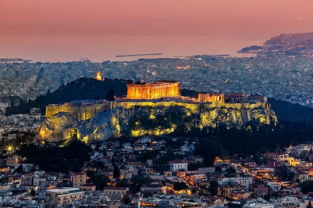
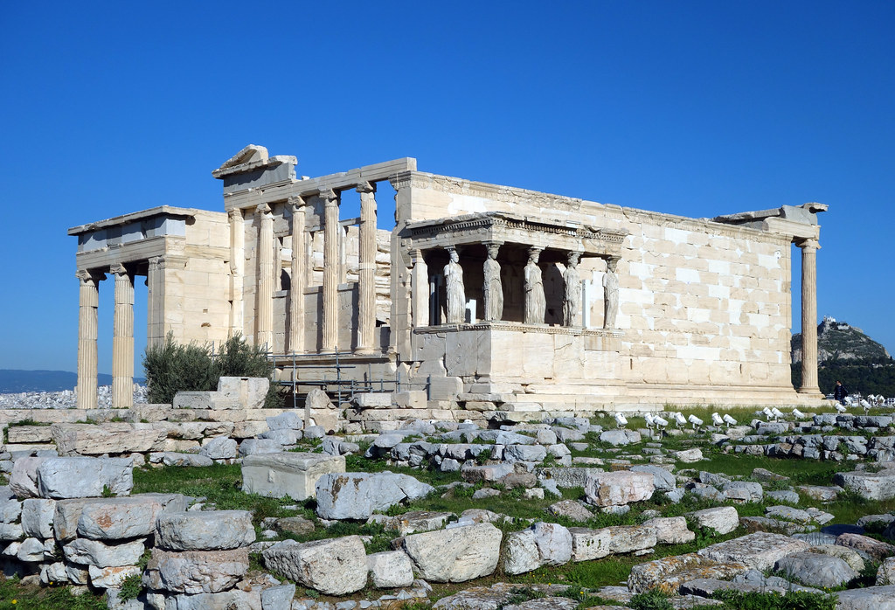
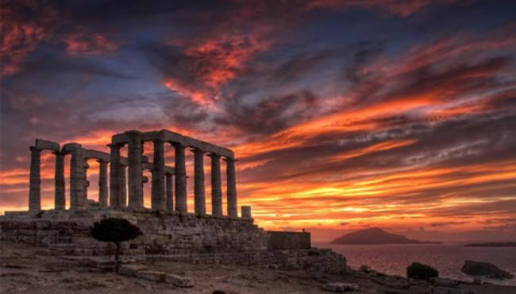

# Cool things to do in Athens

Foto owned by [ceoworld.biz](https://ceoworld.biz/)

Are you planning to visit Athens and searching for exciting activities to spend your time? This guide will help you find the most suitable way to explore the city depending on your taste!

## Food

Here are the best places where you can enjoy the Greek food.

## Night Life

Of course, when you visit Athens, you cannot skip its night life. Below, we have listed some of the best bars for you.

## Tours

In order to enjoy the beauty of the city, you have to walk. So here are some tours worth doing.

## Monuments

Athens is famous for its history and its numerous monuments and museums, you don't want to miss that part.

**Acropolis**
>The most famous historical monument in Greece

The Acropolis of Athens is the most famous historical monument in Greece. It was constructed in the mid 5th century BC, also known as the Golden Century of Athens. Although the most famous building on the Acropolis is the Parthenon, there are many other buildings, like the Propylaea, the Erechtheion and the Temple of Athena Nike. The Acropolis was entirely made of the finest Pentelic marble and by the best craftsmen of the era. Along the centuries that followed, it was largely destroyed by wars. The greatest destructions were in 1687 by a Venetian gun, and in 1816 when Lord Elgin removed many parts of the Parthenon frieze.

*All info retrieved from:* [Greeka](https://www.greeka.com/greece-history/monuments/)

**Erechtheion**

The Erechtheion is an ancient Greek temple located on the north side of the Acropolis. The temple was erected in 421-406 BC and was dedicated to both Athena and Poseidon. In particular, the eastern part of the building was dedicated to Athena Polias, while the western part served the cult of Poseidon-Erechtheus and held the altars of Hephaistus and Voutos, brother of Erechtheus.

On the north side of the temple, there is the famous "Porch of the Maidens", with six sculpted female figures (Caryatids) serving as supporting columns. Five of them are in the Acropolis Museum and the last one in the British Museum; those on the building are casts.

*Information retrieved from:* [VisitGreece](http://www.visitgreece.gr/en/culture/monuments/erechtheion) |
*Photo of Erechtheion retrieved from:* [Wikipedia](https://en.wikipedia.org/wiki/Erechtheion)

**Temple of Poseidon**

*Photo taken from:* [GreekTravelPages](https://www.gtp.gr/TDirectoryDetails.asp?ID=14990)

One of the most stunning views all over Greece as well as a monument difficult to forget. Located at the southernmost tip of Attica the Temple of Poseidon is build to impress and educate us about history. Stories around this temple involve King Menelaus who stopped there on his way back from Troy and King Aegeus who had the unfortunate fate of drowning on that spot, thus giving his name to the Aegean Sea.

Organizing a trip to the Temple of Poseidon is worth your time but making the most of your trip is also important by swimming on the beach, underneath the monument, getting an astonishing experience of clear blue waters.

*Info extracted from:*[VisitGreece](http://www.visitgreece.gr/en/culture/archaeological_sites/the_archaeological_site_of_sounio)

## Activities

Athens has many things to do for athletics individuals too! From walking to our famous mountains to skydiving!

**Hiking**

Going hiking is a great way to explore and get to know Athens! There are a lot of places ideal for a hiking adventure!
1. Sounion National Park

Sounion is most known for Poseidon's mighty temple and its magnificent sunsets. Lying about 50km south-east of Athens, the  Sounion National Park hosts relics of ancient silver, lead and zinc mines, as well as cave fossils unique to the whole of Greece. Inside the park you will find a magnificent and easy trail which starts near the Agios Konstantinos village(you will usually find a parking spot there), it surrounds the dramatic Chaos gulch (a collapsed ancient cave), it continues briefly on tarmac and then the view opens and you can see the city of Lavrion as well as the islands of Makronisos and Kea. The path arrives at the church of Agia Triada, where you will find natural spring water. From there, a dirty old road will lead you to the ancient mines' washing plants and tanks and then you will come across Kitsios cave. Finally, north of Poseidon's temple you will fing the rocky outcrops of Mavro Lithari and Vasilopoula.
*Information retrieved from:*[AthensInsider](https://athensinsider.com/3-top-hikes-around-athens/)|
*Photo of Sounion National Park retrieved from:* [AthensInsider](https://athensinsider.com/3-top-hikes-around-athens/)
